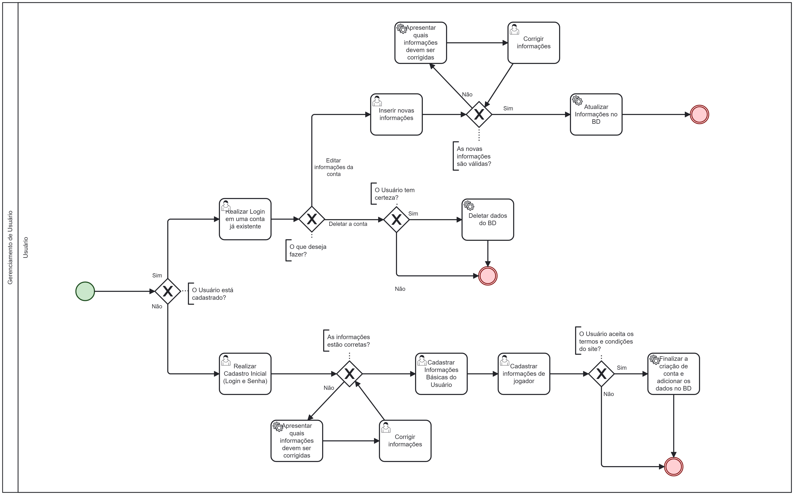

### 3.3.1 Processo 1 – Gerenciamento de Usuário

O processo de Gerenciamento de usuário é bem simples. No PeladIn, buscamos  facilitar o cadastro do usuário requerendo apenas as informações principais apra a criação da conta. No entanto, apresentamos uma nova possibilidade do Usuário inserir  também a sua foto, assim como cadastrar a posição que gosta de jogar futebol, permitindo que futuramente em outros processos essa informação seja utilizada para outros processos. Por fim, apresentamos os "Termos e Condições" que o usuário deve aceitar para finalizar o cadastro. Além disso, permitimos também o Usuário modificar as informações da conta e deletar a conta, caso deseje, para garantir a segurança e privacidade do usuário suas informações serão modificadas no bando de dados conforme o desejo do Usuário.

#### Detalhamento das atividades

**Realizar Cadastro Inicial**

| **Campo**       | **Tipo**         | **Restrições** | **Valor default** |
| ---             | ---              | ---            | ---               |
| Email           | Caixa de Texto   | Formato de e-mail|                 |
| Senha           | Caixa de Texto   | Mínimo de 8 caracteres |           |
| Confirmar Senha | Caixa de Texto   | Mínimo de 8 caracteres igual ao campo senha |           |

| **Comandos**         |  **Destino**                   | **Tipo**        |
| ---                  | ---                            | ---             |
| Continue             | Informações básicas do Usuário |  default        |
| Entre                | Página de Login                |  default        |
| Cancelar             | Página do Perfil               |  cancel         |

**Corrigir Informações**

| **Campo**       | **Tipo**         | **Restrições** | **Valor default** |
| ---             | ---              | ---            | ---               |
| Email           | Caixa de Texto   | Formato de e-mail|                 |
| Senha           | Caixa de Texto   | Mínimo de 8 caracteres |           |
| Confirmar Senha | Caixa de Texto   | Mínimo de 8 caracteres igual ao campo senha |           |

| **Comandos**         |  **Destino**                   | **Tipo**        |
| ---                  | ---                            | ---             |
| Continue             | Informações básicas do Usuário |  default        |
| Entre                | Página de Login                |  default        |
| Cancelar             | Página do Perfil               |  cancel         |

**Cadastrar Informações Básicas do Usuário**

| **Campo**          | **Tipo**         | **Restrições**                                                        | **Valor default** |
| ---                | ---              | ---                                                                   | ---               |
| Nome               | Caixa de Texto   | Até 100 caracteres                                                    |                   |
| Data de Nascimento | Data             | DD/MM/YYYY                                                            |                   |
| Telefone           | Caixa de Texto   | Até 11 caracteres                                                     |                   |

| **Comandos**         |  **Destino**                   | **Tipo**          |
| ---                  | ---                            | ---               |
| Continue             | Página para Cadastrar Informações de Jogador       | default           |
| Voltar               | Página Realizar Cadastro Inicial       | default           |
| Abandonar Cadastro   | Página Inicial                 | cancel            |

**Cadastrar Informações de Jogador**

| **Campo**          | **Tipo**         | **Restrições**                                                        | **Valor default** |
| ---                | ---              | ---                                                                   | ---               |
| Foto               | Imagem           | png/jpeg                                                              |                   |
| Apelido            | Caixa de Texto   | Entre 3 e 20 caracteres                                               |                   |
| Posição            | Seleção Única    | Goleiro, Zagueiro, Lateral, Volante, Meiocampo, Atacante ou Ponta     |                   |
| Termos e Condições | Seleção Única    |                                                                       |                   |

| **Comandos**         |  **Destino**                   | **Tipo**          |
| ---                  | ---                            | ---               |
| Cadastre   | Página Principal               | default           |
| Voltar     | Página Cadastrar Informações Basicas do Usuário | cancel            |

**Realizar Login em uma Conta já Existente**

| **Campo**       | **Tipo**         | **Restrições**         | **Valor default** |
| ---             | ---              | ---                    | ---               |
| Login           | Caixa de Texto   | Formato de e-mail      |                   |
| Senha           | Caixa de Texto   | mínimo de 8 caracteres |                   |

| **Comandos**         |  **Destino**                         | **Tipo** |
| ---                  | ---                                  | ---      |
| Entre                | Página do Principal                  |  default |
| Cadastre-se          | Pagina de Realizar Cadastro Inicial  |  default |
| Cancelar             | Página Inicial                       |  cancel  |

**Modificação da Conta**

| **Comandos**         |  **Destino**                   | **Tipo**            |
| ---                  | ---                            | ---                 |
| Editar Conta         | Informações da Conta           |  default            |
| Deletar Conta        | Pagina Inicial                 |  default            |
| Cancelar             | Página do Perfil               |  cancel             |

**Inserir Novas Informações**

| **Campo**          | **Tipo**         | **Restrições**                                                        | **Valor default** |
| ---                | ---              | ---                                                                   | ---               |
| Apelido            | Caixa de Texto   | Entre 3 e 20 caracteres                                               |                   |
| Posição            | Seleção Única    | Goleiro, Zagueiro, Lateral, Volante, Meio Campista, Atacante ou Ponta |                   |
| Foto               | Imagem           | png/jpeg                                                              |                   |
| Nome               | Caixa de Texto   | Até 100 caracteres                                                    |                   |
| Telefone           | Caixa de Texto   | Até 11 caracteres                                                     |                   |

| **Comandos**         |  **Destino**                   | **Tipo** |
| ---                  | ---                            | ---               |
| Salvar               | Página do Perfil               |  default          |
| Abandonar Edições    | Página do Perfil               |  cancel           |

**Corrigir Informações**

| **Campo**          | **Tipo**         | **Restrições**                                                        | **Valor default** |
| ---                | ---              | ---                                                                   | ---               |
| Apelido            | Caixa de Texto   | Entre 3 e 20 caracteres                                               |                   |
| Posição            | Seleção Única    | Goleiro, Zagueiro, Lateral, Volante, Meio Campista, Atacante ou Ponta |                   |
| Foto               | Imagem           | png/jpeg                                                              |                   |
| Nome               | Caixa de Texto   | Até 100 caracteres                                                    |                   |
| Telefone           | Caixa de Texto   | Até 11 caracteres                                                     |                   |

| **Comandos**         |  **Destino**                   | **Tipo**           |
| ---                  | ---                            | ---                |
| Avançar              | Pagina do Perfil               |  default           |
| Abandonar Modificações| Página Inicial                | cancel             |

