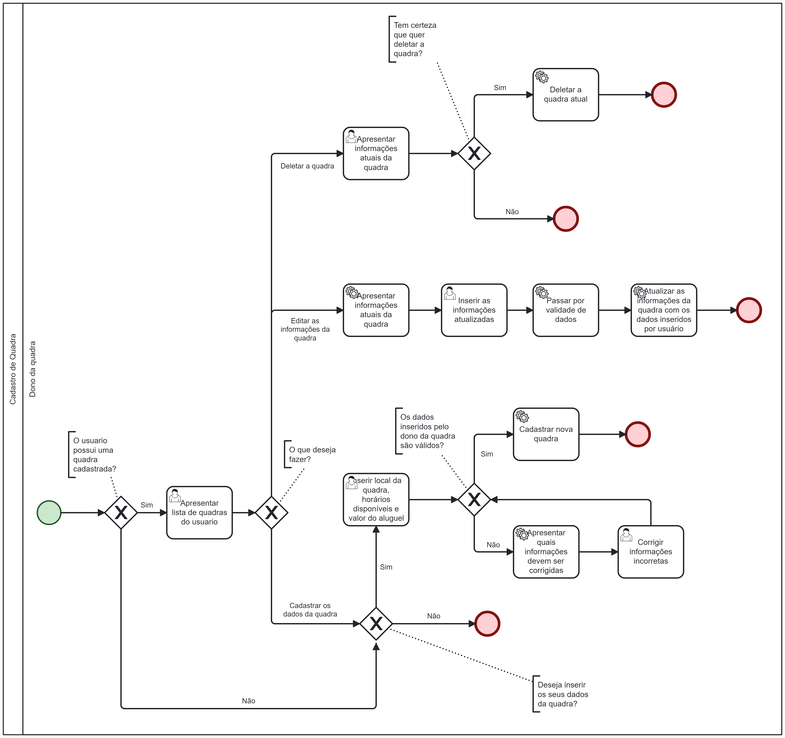

### 3.3.2 Processo 2 – Gerenciamento de Quadras

O processo de gerenciamento de quadras é fundamental para uma boa organização e cuidado com o local em que será marcada a partida de futebol.

Em nosso projeto, temos o objetivo de auxiliar e dar todo suporte aos donos das quadras, tornando o cadastro das mesmas mais simplificado e sem burocracias.

Após acessar, os usuários que desejam adicionar sua quadra ao PeladIn deverão informar os dados do local, valor de aluguel e cuidados necessários para a preservação da quadra. 

Para garantir a qualidade e relevância das quadras listadas, também disponibilizamos a opção de remover uma quadra do PeladIn e corrigir as informação da quadra, caso ela não esteja mais disponível para aluguel ou não atenda aos critérios estabelecidos.

Ao fim de todas essas etapas, nosso sistema irá analisar e aprovar as quadras válidas para serem alugadas e informar caso algum dado esteja irregular.

#### Detalhamento das atividades

**Apresentar lista de quadras do usuário**

| **Campo**       | **Tipo**         | **Restrições** | **Valor default** |                                
| ---             | ---              | ---            | ---               |
| [Nome da Quadra] | [Campo de Texto]  |    Deve ser único para cada quadra e não conter caracteres especiais.       |  | 
| [Foto da Quadra] | [Imagem]  |    PNG/JPEG        |  |
| [Descrição da Quadra] | [Campo de Texto]  |   Deve ter no mínimo 1 caractere e no máximo 255 caracteres.    |  |     

| **Comandos**         |  **Destino**                   | **Tipo** |
| ---                  | ---                            | ---               |
| Editar | Editar informações da Quadra   | default |
| Remover | Deletar Quadra  | default |

**Inserir local da quadra, horário disponível e valor do aluguel**

| **Campo**       | **Tipo**         | **Restrições** | **Valor default** |                                
| ---             | ---              | ---            | ---               |
| [Nome da Quadra] | [Campo de Texto]  |    Deve ser único para cada quadra e não conter caracteres especiais.       |  | 
| [Localização] | [Área de Texto]  |      Deve ser uma localização válida, indicando a área onde há quadras.     |                  |
| [Capacidade] | [Número]  |     Limite de jogadores que podem frequentar a quadra.      |                | 
| [Contato do Dono] | [Campo de Texto]  |     Deve fornecer informações de contato válidas do proprietário, como e-mail ou número de telefone.     |    
| [Tipo de Quadra] | [Campo de Texto]  |    O tipo de quadra deve ser society, grama natural, grama sintética ou futsal.        |  |
| [Valor da Quadra] | [Número]  |    Deve ser um número positivo representando o valor da quadra.        |  |
| [Foto da Quadra] | [Imagem]  |    PNG/JPEG        |  |
| [Descrição da Quadra] | [Campo de Texto]  |  Deve ter no mínimo 1 caractere e no máximo 255 caracteres.    |    

| **Comandos**         |  **Destino**                   | **Tipo** |
| ---                  | ---                            | ---               |
| Enviar | Página principal  | default |
| Cancelar | Página principal  | cancel |

**Corrigir informações incorretas**

| **Campo**       | **Tipo**         | **Restrições** | **Valor default** |                                
| ---             | ---              | ---            | ---               |
| [Nome da Quadra] | [Campo de Texto]  |    Deve ser único para cada quadra e não conter caracteres especiais.       | [Nome atual] | 
| [Localização] | [Área de Texto]  |      Deve ser uma localização válida, indicando a área onde há quadras.     |   [Localização atual]               |
| [Capacidade] | [Número]  |     Limite de jogadores que podem frequentar a quadra.      |    [Capacidade atual]            | 
| [Contato do Dono] | [Campo de Texto]  |     Deve fornecer informações de contato válidas do proprietário, como e-mail ou número de telefone.     |         [Contato atual]
| [Tipo de Quadra] | [Campo de Texto]  |    O tipo de quadra deve ser society, grama natural, grama sintética ou futsal.        | [Quadra Atual] |
| [Valor da Quadra] | [Número]  |    Deve ser um número positivo representando o valor da quadra.        | [Valor Atual] |
| [Foto da Quadra] | [Imagem]  |    PNG/JPEG        | Foto Atual |
| [Descrição da Quadra] | [Campo de Texto]  |  Deve ter no mínimo 1 caractere e no máximo 255 caracteres.    |    Descrição Atual

| **Comandos**         |  **Destino**                   | **Tipo** |
| ---                  | ---                            | ---               |
| Atualizar | Página principal  | submit |
| Cancelar | Página principal  | cancel |

**Inserir as informações atualizadas**

| **Campo**       | **Tipo**         | **Restrições** | **Valor default** |                                
| ---             | ---              | ---            | ---               |
| [Nome da Quadra] | [Campo de Texto]  |    Deve ser único para cada quadra e não conter caracteres especiais.       | [Nome atual] | 
| [Localização] | [Área de Texto]  |      Deve ser uma localização válida, indicando a área onde há quadras.     |   [Localização atual]               |
| [Capacidade] | [Número]  |     Limite de jogadores que podem frequentar a quadra.      |    [Capacidade atual]            | 
| [Contato do Dono] | [Campo de Texto]  |     Deve fornecer informações de contato válidas do proprietário, como e-mail ou número de telefone.     |         [Contato atual]
| [Tipo de Quadra] | [Campo de Texto]  |    O tipo de quadra deve ser society, grama natural, grama sintética ou futsal.        | [Quadra Atual] |
| [Valor da Quadra] | [Número]  |    Deve ser um número positivo representando o valor da quadra.        | [Valor Atual] |
| [Foto da Quadra] | [Imagem]  |    PNG/JPEG        | Foto Atual |
| [Descrição da Quadra] | [Campo de Texto]  |  Deve ter no mínimo 1 caractere e no máximo 255 caracteres.    |    [Descrição Atual]

| **Comandos**         |  **Destino**                   | **Tipo** |
| ---                  | ---                            | ---               |
| Corrigir | Página principal  | submit |
| Cancelar | Página principal  | cancel |

**Apresentar informações atuais da quadra**

| **Campo**       | **Tipo**         | **Restrições** | **Valor default** |                                
| ---             | ---              | ---            | ---               |
| [Nome da Quadra] | [Campo de Texto]  |    Deve ser único para cada quadra e não conter caracteres especiais.       | [Nome atual] | 
| [Localização] | [Área de Texto]  |      Deve ser uma localização válida, indicando a área onde há quadras.     |   [Localização atual]               |
| [Capacidade] | [Número]  |     Limite de jogadores que podem frequentar a quadra.      |    [Capacidade atual]            | 
| [Contato do Dono] | [Campo de Texto]  |     Deve fornecer informações de contato válidas do proprietário, como e-mail ou número de telefone.     |         [Contato atual]
| [Tipo de Quadra] | [Campo de Texto]  |    O tipo de quadra deve ser society, grama natural, grama sintética ou futsal.        | [Quadra Atual]|
| [Valor da Quadra] | [Número]  |    Deve ser um número positivo representando o valor da quadra.        | [Valor Atual] |
| [Foto da Quadra] | [Imagem]  |    PNG/JPEG        | Foto Atual |
| [Descrição da Quadra] | [Campo de Texto]  |  Deve ter no mínimo 1 caractere e no máximo 255 caracteres.    |    [Descrição Atual]
