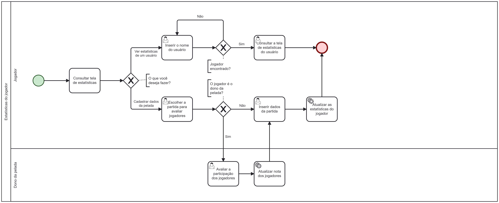

### 3.3.3 Processo 3 – Estatísticas do jogador

O processo de estatísticas de um jogador pode ser bastante complexo devido à necessidade de coletar uma variedade de dados e métricas relevantes, o que pode representar um desafio significativo para aqueles que desejam entender e aprimorar seu desempenho em peladas.

No PeladIn, simplificamos esse processo. A cada partida, será necessário inserir apenas as estatísticas da pelada e avaliar os outros jogadores. Nosso sistema calcula automaticamente as estatísticas personalizadas para cada usuário, que são facilmente visualizadas em seus perfis. Sem complicações, permitindo que a atividade principal seja jogar e se divertir nas peladas.

#### Detalhamento das atividades

**Consultar tela de estatísticas**

| **Comandos**               |  **Destino**                | **Tipo** |
| ---                        | ---                         | ---      |
| Acessar estatísticas       | Página de estatísticas      | default  |
| Cadastrar dados de partida | Página de escolher partidas | default  |
| Voltar                     | Página principal            | cancel   |

**Escolher Partida para Avaliar Jogador**

| **Campo**                | **Tipo**         | **Restrições**               | **Valor default** |
| ---                      | ---              | ---                          | ---               |
| Pesquisar partida        | Caixa de texto   |                              |                   |             
| Partidas disputadas      | Seleção única    |                              |                   |              

| **Comandos**       |  **Destino**                      | **Tipo** |
| ---                | ---                               | ---      |
| Selecionar partida | Página da partida                 | default  |
| Cancelar           | Página Inicial                    | cancel   |

**Avaliar a participação dos jogadores**

| **Campo**                 | **Tipo**       | **Restrições**          | **Valor default** |
| ---                       | ---            | ---                     | ---               |
| Apelido do jogador        | Campo de texto | Entre 3 e 20 caracteres |                   |
| Foto do jogador           | Imagem         |                         |                   |
| Avaliação Participação    | Seleção única  | Número entre 1 e 5      | 1                 |

| **Comandos** |  **Destino**     | **Tipo** |
| ---          | ---              | ---      |
| Avaliar      | Página principal | default  |
| Agora não    | Página principal | cancel   |

**Inserir dados da partida**

| **Campo**    | **Tipo** | **Restrições**          | **Valor default** |
| ---          | ---      | ---                     | ---               |
| Gols         | Número   | Número inteiro positivo | 0                 |
| Assistências | Número   | Número inteiro positivo | 0                 |
| Defesas      | Número   | Número inteiro positivo | 0                 |

| **Comandos** |  **Destino**             | **Tipo** |
| ---          | ---                      | ---      |
| Inserir      | Página avaliar jogadores | default  |
| Agora não    | Página avaliar jogadores | cancel   |

**Avaliar o desempenho de outros jogadores**

| **Campo**                 | **Tipo**       | **Restrições**          | **Valor default** |
| ---                       | ---            | ---                     | ---               |
| Avaliação                 | Seleção única  | Número entre 1 e 5      | 1                 |
| Foto do jogador           | Imagem         |                         |                   |
| Apelido do jogador        | Campo de texto | Entre 3 e 20 caracteres |                   |

| **Comandos** |  **Destino**     | **Tipo** |
| ---          | ---              | ---      |
| Avaliar      | Página principal | default  |
| Agora não    | Página principal | cancel   |

**Inserir o nome do usuário para saber as informações**

| **Campo**       | **Tipo**         | **Restrições**          | **Valor default** |
| ---             | ---              | ---                     | ---               |
| Nome do jogador | Caixa de texto   | Entre 3 e 20 caracteres |                   |
| Jogadores       | Seleção única    |                         |                   |

| **Comandos** |  **Destino**                      | **Tipo** |
| ---          | ---                               | ---      |
| Pesquisar    | Página de estatísticas do usuario | default  |
| Cancelar     | Página de estatísticas            | cancel   |

**Consultar Tela de Estatísticas do Usuário**

| **Campo**        | **Tipo**         | **Restrições**          | **Valor default** |
| ---              | ---              | ---                     | ---               |
| Nome do jogador  | Caixa de texto   | Entre 3 e 20 caracteres |                   |
| Foto do jogador  | Imagem           |                         |                   |
| Nota participação| Número           | Número inteiro positivo |                   |
| Overall          | Número           | Número inteiro positivo |                   |
| Jogos            | Número           | Número inteiro positivo |                   |
| Gols             | Número           | Número inteiro positivo |                   |
| Assistências     | Número           | Número inteiro positivo |                   |
| Defesas          | Número           | Número inteiro positivo |                   |
| ATA              | Número           | Número inteiro positivo |                   |
| DEF              | Número           | Número inteiro positivo |                   |
| FOR              | Número           | Número inteiro positivo |                   |
| Craque da pelada | Número           | Número inteiro positivo |                   |
| Bagre da pelada  | Número           | Número inteiro positivo |                   |

| **Comandos**      |  **Destino**                    | **Tipo** |
| ---               | ---                             | ---      |
| Voltar            |         Página principal        | cancel   |
