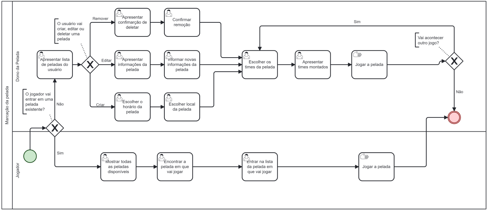

### 3.3.4 Processo 4 – Marcação de Pelada 

No estágio inicial do processo de marcação de peladas, os jogadores se deparam com uma decisão crucial: integrar-se a uma lista de jogadores já existente ou inaugurar uma nova. Esta decisão não apenas determina sua participação imediata, mas também molda a dinâmica futura do evento esportivo.

Com o Peladin, nossa plataforma oferece aos usuários uma liberdade sem precedentes. Eles são capacitados a escolher a abordagem que melhor se adapta às suas necessidades individuais. O dono da pelada pode optar por delegar ao sistema a responsabilidade pelo sorteio automático dos times, aproveitando-se da eficiência e imparcialidade que isso proporciona. No entanto, aqueles que preferem uma abordagem mais pessoal e direta têm a opção de formar os times manualmente, sem nenhum obstáculo.

#### Detalhamento das atividades

**Escolher o horário da pelada (Dono da Bola)**

| **Campo**       | **Tipo**         | **Restrições** | **Valor default** |
| ---             | ---              | ---            | ---               |
| Data     | Data   | Não podem haver caracteres ou símbolos, apenas números. Não pode ter um intervalo maior que um mês a partir da tentativa de reserva.            | ---               |
| Foto | Imagem| .png ou .jpg
| Horario               | Hora   | 24 horas e 60 minutos     |                   |
| Duração               | Hora   | 24 horas e 60 minutos     |                   |
| Nome               | Caixa de Texto   | Até 20 caracteres     |                   |
| Descrição          | Caixa de Texto   | Até 100 caracteres     |                   |

| **Comandos**         |  **Destino**                   | **Tipo** |
| ---                  | ---                            | ---               |
| Avançar | Página de quadras disponíveis  | default |
| Cancelar | Página principal              | cancel |

**Escolher o local da pelada (Dono da Bola)**

| **Campo**       | **Tipo**         | **Restrições** | **Valor default** |
| ---             | ---              | ---            | ---               |
| Quadra | Seleção Unica  |  Quadras já cadastradas             |                   |

| **Comandos**         |  **Destino**                   | **Tipo**          |
| ---                  | ---                            | ---               |
| Avançar | Página de confirmção da pelada  | default |
| Cancelar | Página principal  | cancel |

**Conferir o Aluguel da Quadra**

| **Campo**       | **Tipo**         | **Restrições** | **Valor default** |
| ---             | ---              | ---            | ---               |
| Data| Data              |  ---      | Data escolhida pelo usuário            |
| Foto| Imagem              |  ---      | Foto colocada pelo usuário
| Horario        | Hora              | ---          | Horario escolhido pelo usuário                |
| Duração        | Hora              | ---          | Duração escolhido pelo usuário                |
| Nome da Pelada             | Area de texto              | ---            | Nome escolhido pelo usuário               |
| Descrição            | Area de texto              | ---            | Descrição escolhida pelo usuário               |
| Local             | Area de texto              | ---            | Endereço da quadra escolhida pelo usuário               |

| **Comandos**         |  **Destino**                   | **Tipo**          |
| ---  |  ---  | ---  |
| Confirmar | Página Principal  | default |
| Cancelar | Página Principal  | cancel |

**Escolher a pelada em que vai jogar**

| **Campo**           | **Tipo**         | **Restrições** | **Valor default** |
| ---                 | ---              | ---            | ---               |
| Pesquisar local  |Área de Texto  |    |    |
|Peladas| Seleção Unica|Pelada já deve estar marcada no sistema|---

| **Comandos**         |  **Destino**                   | **Tipo**          |
| ---  |  ---  | ---  |
| Confirmar | Tela de informações da pelada | default |
| Cancelar | Página Principal            | cancel  |

**Escolher os Times da Pelada (Dono da Bola)**

| **Campo**           | **Tipo**         | **Restrições** | **Valor default** |
| ---                 | ---              | ---            | ---               
|Jogadores| Area de texto| Jogadores que entraram na pelada|---
|Time 1| Area de texto| Jogadores escolhidos para o time 1|---
|Time 2| Area de texto| Jogadores escolhidos para o time 2|---

| **Comandos**         |  **Destino**                   | **Tipo**          |
| ---  |  ---  | ---  |
| Confirmar | Tela de visualizar os times  | default |
| Cancelar | Página Principal            | cancel  |

**Viusalizar times montados**
| **Campo**           | **Tipo**         | **Restrições** | **Valor default** |
| ---                 | ---              | ---            | ---               
|Time 1| Area de texto| ---|Jogadores escolhidos para o time 1
|Time 2| Area de texto| ---|Jogadores escolhidos para o time 2

| **Comandos**         |  **Destino**                   | **Tipo**          |
| ---  |  ---  | ---  |
| Editar | Tela de escolher times  | default |
| Cancelar | Página Principal            | cancel  |

**Inserir resultado da pelada**

| **Campo**       | **Tipo**         | **Restrições** | **Valor default** |
| ---             | ---              | ---            | ---               |
|Nome da Pelada|Area de texto|---|Nome escolhido pelo usuário|
| Data| Data              |  ---      | Data escolhida pelo usuário            |
| Horario        | Hora              | ---          | Horario escolhido pelo usuário                |
| Local             | Area de texto              | ---            | Endereço da quadra escolhida pelo usuário               |
| Gols do time 1  |     Area de texto  | Numero inteiro     | ---   |
| Gols do time 2  |     Area de texto  | Numero inteiro     | ---   |

| **Comandos**         |  **Destino**                   | **Tipo**          |
| ---  |  ---  | ---  |
| Confirmar | Página Principal  | default |
| Cancelar | Página Principal  | cancel |
