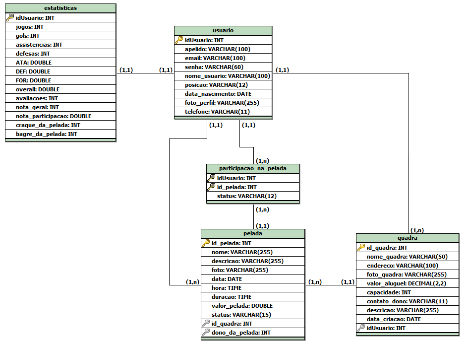

## 4. Projeto da solução

### 4.1. Modelo de dados

---

### 4.2. Tecnologias

| **Dimensão**   | **Tecnologia**        |
| ---            | ---                   |
| Front end      | HTML, CSS e JS        |
| Back end       | Java SpringBoot       |
| SGBD           | MySQL                 |
| Testes         | JUnit Jupiter         |
| Deploy         | Github Pages          |
| IDE            | Vs Code, IntelliJ     |
| Framework      | Bootstrap 5, Tailwind |
| Tipografia     | Google fonts          |
| Iconografia    | Flaticon              |
| Prototipagem   | Figma                 |
